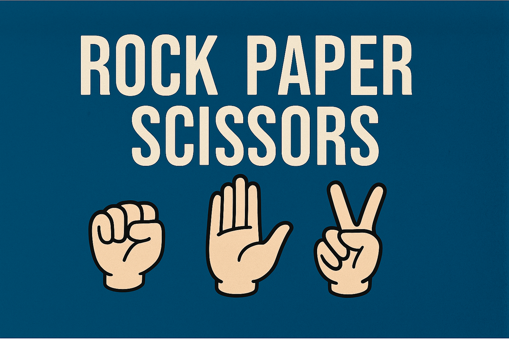

# ✊🖐️✌️ Rock Paper Scissors

A terminal-based Rock Paper Scissors game built in Python as part of Day 4 of the **100 Days of Code: Python Bootcamp**. The player chooses a hand sign, and the computer randomly selects one in return — may the best sign win!

## 💡 What I Learned
- Using `random.randint()` to simulate computer choices
- Validating user input
- Simplifying win logic with conditional statements
- Displaying ASCII art for visual feedback

## 🚀 How to Play
Run `main.py` in a Python environment and follow the prompt.

## 📚 Credits
Inspired by the 100 Days of Code: Python Bootcamp by Dr. Angela Yu.

## 📄 License
This project is licensed under the MIT License.